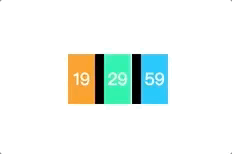
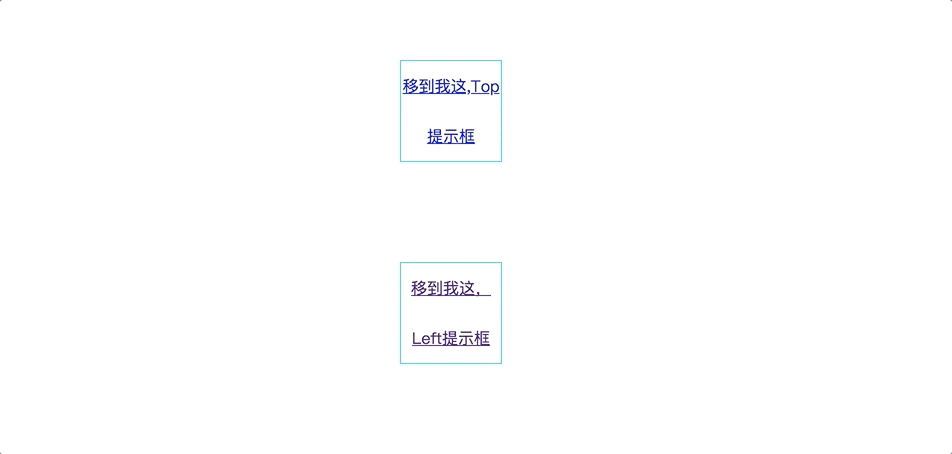
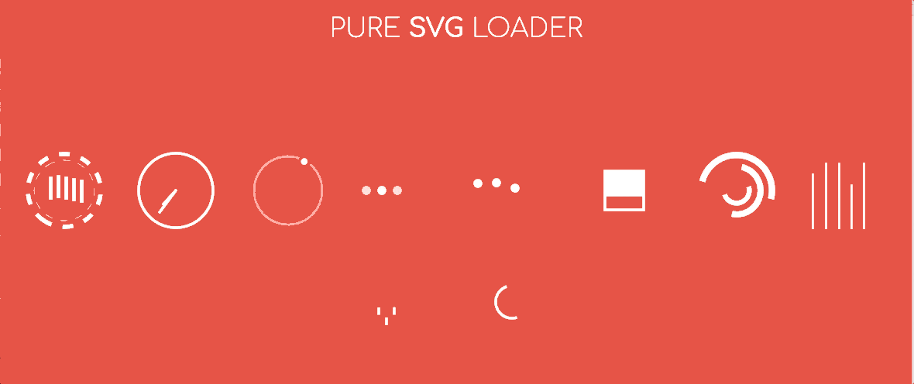
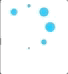
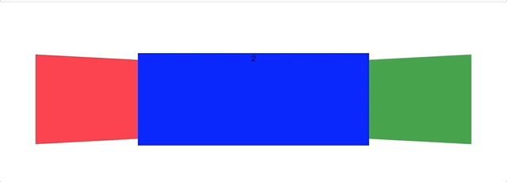
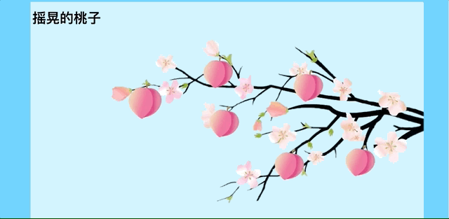
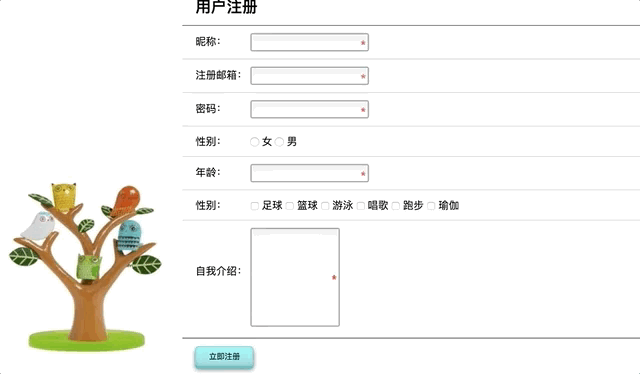

## Summary
**All Web Test**

* Countdown 封装成函数



* mouseRotate 封装成函数，div随之鼠标的移动旋转平移


* toolTip封装成函数，默认top，提示框



* First_Web


* Second_Web


* SVGLoading



* CSSLoading01


* CSSLoading02



* click


* clock


* divCarousel



* PersonalInfomation


* SloshingPeachs



* RegisterPage



* navFollowScroll


* scroll + requestAnimationFlame + 实现 jq fadein fadeout

```
        // 请求帧动画过渡
        //scrollValue:body scroll过渡滚动 Y轴的距离
        //ele:模仿jq的fadein、fadeout所需的元素
        //frame:每一帧opacity的增加或减少，默认是0.01
        function RequestFrame({ scrollValue, ele, frame }) {
            //页面要滚动到哪个位置 Y轴
            this.scrollValue = scrollValue || 0;
            this.firstStartRequestAnimationFrameScroll = true;
            this.ele = ele || '';
            this.frame = frame || 0.01;
            this.pre = 0;
            this.upOrDown = true;
            this.requestAnimationFrameScrollHandle = 0;
            this.requestAnimationFrameFadeinHandle = 0;
            this.requestAnimationFrameFadeoutHandle = 0;
            this.requestAnimationFrameScroll = this.requestAnimationFrameScroll.bind(this)
            this.requestAnimationFrameFadein = this.requestAnimationFrameFadein.bind(this)
            this.requestAnimationFrameFadeout = this.requestAnimationFrameFadeout.bind(this)
        }
        RequestFrame.prototype = {
            constructor: RequestFrame,
            // body scroll过渡滚动
            requestAnimationFrameScroll() {
                this.startRequestAnimationFrameScroll()
                
                let s;
                //兼容模式和未兼容模式
                if (typeof window.pageYOffset != 'undefined') {
                    s = window.pageYOffset;
                }
                else if (typeof document.compatMode != 'undefined' && document.compatMode != 'BackCompat') {
                    s = document.documentElement.scrollTop;
                }
                else if (typeof document.body != 'undefined') {
                    s = document.body.scrollTop;
                }
                if(this.firstStartRequestAnimationFrameScroll){
                    this.firstStartRequestAnimationFrameScroll = false;
                    if(s <= this.scrollValue)
                        this.upOrDown = true;
                }
                switch (this.upOrDown) {
                    case true:
                        s += 33;
                        document.documentElement.scrollTop = s
                        console.log(this.scrollValue)
                        if (s > this.scrollValue || document.documentElement.scrollTop === this.pre) {
                            console.log('stop')
                            this.stopRequestAnimationFrameScroll()
                        }
                        this.pre = document.documentElement.scrollTop;
                        break;
                    case false:
                        s -= 33;
                        document.documentElement.scrollTop = s
                        console.log(this.scrollValue)
                        if (s < this.scrollValue || document.documentElement.scrollTop === this.pre) {
                            console.log('stop')
                            this.stopRequestAnimationFrameScroll()
                        }
                        this.pre = document.documentElement.scrollTop;
                        break;
                    default: break;
                }
            },
            startRequestAnimationFrameScroll() {
                this.requestAnimationFrameScrollHandle = requestAnimationFrame(this.requestAnimationFrameScroll)
            },
            stopRequestAnimationFrameScroll() {
                cancelAnimationFrame(this.requestAnimationFrameScrollHandle)
            },
            // 模仿jq的fadein
            requestAnimationFrameFadein() {
                // 当鼠标移出来时，去掉fadeout的AnimationFrame
                this.stopRequestAnimationFrameFadeout()
                this.startRequestAnimationFrameFadein()
                if (this.ele.style.opacity === "") {
                    this.ele.style.opacity = 0;
                }
                if (this.ele.style.display === "" || this.ele.style.display === 'none') {
                    this.ele.style.display = 'block';
                }

                if (this.ele.style.opacity < 1) {
                    this.ele.style.opacity = parseFloat(this.ele.style.opacity) + this.frame;
                } else {
                    this.stopRequestAnimationFrameFadein()
                }
            },
            startRequestAnimationFrameFadein() {
                this.requestAnimationFrameFadeinHandle = requestAnimationFrame(this.requestAnimationFrameFadein)

            },
            stopRequestAnimationFrameFadein() {
                cancelAnimationFrame(this.requestAnimationFrameFadeinHandle)
            },
            //模仿jq的fadeout
            requestAnimationFrameFadeout() {
                // 当鼠标移出来时，去掉fadein的AnimationFrame
                this.stopRequestAnimationFrameFadein()
                this.startRequestAnimationFrameFadeout()
                if (this.ele.style.opacity === "") {
                    this.ele.style.opacity = 1;
                }
                if (this.ele.style.display === "" || this.ele.style.display === 'none') {
                    this.ele.style.display = 'block';
                }
                if (this.ele.style.opacity > 0) {
                    this.ele.style.opacity = parseFloat(this.ele.style.opacity) - this.frame;
                } else {
                    this.ele.style.display = 'none'
                    this.stopRequestAnimationFrameFadeout()
                }
            },
            startRequestAnimationFrameFadeout() {
                this.requestAnimationFrameFadeoutHandle = requestAnimationFrame(this.requestAnimationFrameFadeout)
            },
            stopRequestAnimationFrameFadeout() {
                cancelAnimationFrame(this.requestAnimationFrameFadeoutHandle)
            }
        }
```
Finally
-----
CSS&JS的一些实验
